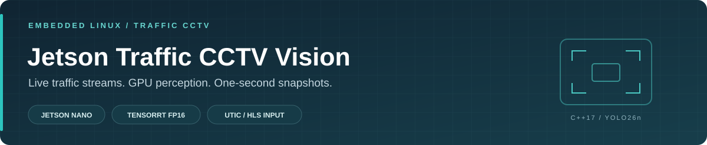
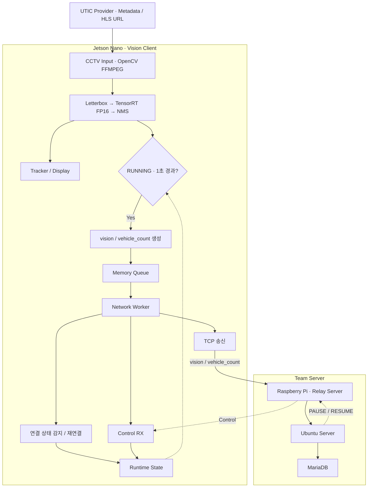

<p align="center">
  
</p>

<p align="center">
  
  
  
  
  
</p>

<p align="center">
  <a href="#validation">Validation</a> · <a href="#performance">Performance</a> · <a href="#architecture">Architecture</a> · <a href="#network-data">Network Data</a> · <a href="#build">Build</a> · <a href="#run">Run</a>
</p>

# Jetson Traffic CCTV Vision

**Jetson Nano에서 UTIC CCTV 영상을 실시간 처리하고 차량 탐지 결과를 Relay Server로 전송하는 C++17 Vision Client입니다.**

> **팀 프로젝트 적용:** 개인 프로젝트 [Jetson Edge Vision](https://github.com/triton0305/jetson-edge-vision)의 TensorRT FP16 추론 파이프라인을 기반으로, 팀 프로젝트 요구사항에 맞춰 UTIC CCTV Provider / Input 계층과 1초 주기 데이터 전송을 구현했습니다. 생성된 `vision` / `vehicle_count` 데이터는 팀 프로젝트의 [Relay Server](https://github.com/LeeKiBeom1/iot_yolo_project)로 전달합니다.

## Development History

| 날짜 | 개발 내용 |
|---|---|
| [2026.10.06](https://github.com/triton0305/jetson-traffic-cctv-vision/commit/9a5ec4c741543d3b123f2e78a0c5eeb7d51fb5c7) | UTIC CCTV 입력·HLS 처리·1초 Snapshot 전송 추가 |
| [2026.10.07](https://github.com/triton0305/jetson-traffic-cctv-vision/commit/74bd9d2f4dd0cbdc0a277b8350fcf1f4e41af94d) | 일시적 UTIC 시작 실패 재시도 및 오류 진단 개선 |

## Validation

Jetson Nano에서 UTIC CCTV 입력부터 TensorRT 추론, Tracking, Snapshot 전송까지 통합 검증했습니다.

| 검증 범위 | 확인 항목 | 결과 |
|---|---|:---:|
| CCTV 입력 | UTIC 조회 · 메타데이터 · HLS URL · FFMPEG · 1280×720 프레임 | PASS |
| Vision | TensorRT YOLO26n FP16 · 차량 탐지 / NMS · Tracking / Display | PASS |
| 전송 / 제어 | 1초 Snapshot · PAUSE / RESUME | PASS |
| 종료 | SIGINT Graceful Shutdown | PASS |
| 자동 테스트 | Snapshot · UTIC Provider · Network Integration · CCTV Recovery | 4/4 PASS |

<details>
<summary><strong>자동 테스트 및 트러블슈팅 상세</strong></summary>

| 테스트 | 검증 내용 |
|---|---|
| `snapshot` | 1초 주기 · 객체별 메시지 · 미검출 0 전송 · ID / 프레임 일치 · PAUSE / RESUME |
| `utic_cctv_provider` | 환경변수 상속 · CCTV 선택 · 주석 제외 · HLS query 보존 · 확장자 없는 URL 추출 |
| `network_integration` | TCP 프레이밍 · Control · 재연결 · 과거 데이터 차단 · 큐 경쟁 · 종료 |
| `cctv_recovery` | URL 갱신의 일시적 오류 재시도 · 복구 불가 오류 전달 · 종료 처리 |

**HLS URL 선택 오류** — UTIC 재생 페이지의 HTML / JavaScript 주석에도 `.m3u8` 문자열이 있어 잘못된 URL이 선택될 수 있었습니다. 주석 영역을 제외하고 재생 URL을 추출하며 query parameter를 유지하도록 수정하고 회귀 테스트를 추가했습니다.

**일시적 시작 실패** — UTIC 조회의 일시적 네트워크 오류는 30초 대기 후 재시도합니다. 조회 시도는 시작과 실행 중 URL 갱신을 합쳐 실행당 최대 4회입니다. 일시적 curl 오류는 open-data / metadata / playback-page 단계와 원인을 표시하며, 재시도 대기 중 Ctrl+C로 종료할 수 있습니다.

**API Key 전달 오류** — Shell에서 API Key를 설정했지만 실행 프로세스에서 환경변수를 확인할 수 없는 문제가 있었습니다. Child process의 환경을 확인해 서버나 API 장애가 아닌 환경변수 전달 문제로 범위를 좁혔으며, 실행 프로세스까지 필요한 환경변수가 전달되도록 수정했습니다.

**Snapshot 부분 폐기** — 기존 메시지 단위 bounded queue는 포화 시 가장 오래된 메시지 하나를 폐기해, 같은 1초 Snapshot의 일부 `vision`만 유실될 수 있었습니다. Queue 관리 단위를 메시지에서 Snapshot으로 변경해 포화 시 오래된 Snapshot 전체를 폐기하도록 수정했으며, 객체별 `vision`, `vehicle_count`, 4-byte big-endian length-prefix 등 기존 서버 인터페이스는 유지했습니다.

**대량 객체 Snapshot 검증** — Snapshot 단위 Queue 변경 후 차량 0대·16대·20대뿐 아니라 100대 조건까지 검증했습니다. 차량 100대에서 `vision` 100개와 `vehicle_count` 1개, 총 101개 메시지가 생성되고 로컬 TCP 서버에서 101개 모두 누락·중복 없이 수신되는 것을 확인했습니다. Queue 포화 시에도 개별 메시지가 아닌 오래된 Snapshot 전체가 폐기되는 것을 검증했습니다.

**PAUSE 중 과거 Snapshot 누적** — 네트워크 또는 downstream 장애 중 Snapshot이 계속 쌓이면 복구 후 오래된 차량 정보가 전송될 수 있습니다. PAUSE 시 미전송 Snapshot을 폐기하고 영상 처리와 TensorRT 추론은 유지하며, RESUME 후 새로운 프레임의 Snapshot부터 전송하도록 구성했습니다.

**Snapshot 전달 보장 범위** — Snapshot 단위 Queue는 Queue 포화로 같은 Snapshot의 일부 메시지만 폐기되는 문제를 방지합니다. 다만 Snapshot의 개별 메시지를 송신하는 도중 연결이 끊기거나 PAUSE되면 일부 메시지만 서버에 도달할 수 있습니다. Snapshot 전체의 수신·저장을 원자적으로 보장하려면 Snapshot 단위 ACK나 서버 Transaction 등 별도의 프로토콜 지원이 필요합니다.

</details>

## Demo

<p align="center">
  
</p>
<p align="center"><sub>2026.10.07 UTIC CCTV / TensorRT 실행 화면</sub></p>

## Performance

| 영상 처리 | 평균 추론 시간 | 데이터 생성 주기 |
|:---:|:---:|:---:|
| **약 10.5–11 FPS** | **약 55 ms** | **1초** |
| Effective FPS | TensorRT FP16 | 최신 처리 프레임의 Detection |

Jetson Nano에서 1280×720 UTIC CCTV 입력으로 측정한 실행 결과입니다.  
영상 처리 FPS와 네트워크 데이터 생성 주기는 별개이며, 서버 인터페이스 요구사항에 따라 최신 탐지 결과를 1초 주기로 생성·전송합니다.

## Architecture



이 프로젝트의 담당 범위는 **UTIC CCTV 입력부터 TensorRT 차량 탐지, Tracking, 1초 Snapshot 생성, `vision` / `vehicle_count` JSON 생성 및 송신, 네트워크 상태 관리와 `PAUSE` / `RESUME` Control 처리까지의 Jetson Nano Vision Client**입니다.

Jetson Vision Client는 차량 탐지 결과를 기반으로 `vision` / `vehicle_count` JSON을 생성하고 Memory Queue를 통해 TCP로 송신합니다. 데이터는 Raspberry Pi Relay Server를 거쳐 Ubuntu Server로 전달되어 MariaDB에 저장됩니다.

Jetson은 서버 연결 장애를 감지하면 PAUSE 상태로 전환하고 대기 Queue를 비우며, 재연결 후 현재 세션의 `RESUME` Control을 수신하면 새로운 Snapshot부터 전송을 재개합니다.

`track_id`는 Tracking / Display에 사용하며 전송 JSON에는 포함하지 않습니다. Snapshot은 이미지 파일 저장이 아니라 **최신 처리 프레임의 탐지 결과를 주기적으로 JSON으로 만드는 동작**입니다.

## Build

| 구성 | 필요 환경 |
|---|---|
| 언어 / 빌드 | C++17 · CMake 3.16 이상 |
| 영상 입력 / 처리 | OpenCV 4.8.0 + FFMPEG |
| GPU 추론 | CUDA / TensorRT · 호환되는 YOLO26n FP16 engine |
| HTTP / JSON | libcurl · nlohmann/json |

모델은 저장소에 포함하지 않습니다. 개발 실행 전 `models/yolo26n_fp16.engine`을 별도로 준비합니다.

```bash
cmake -S . -B build-cctv \
  -DCMAKE_BUILD_TYPE=Release \
  -DBUILD_TESTING=ON

cmake --build build-cctv -j2

(cd build-cctv && ctest --output-on-failure)
```

## Run

```bash
./run <server_ip> <server_port>
```

<details>
<summary><strong>UTIC API Key 설정</strong></summary>

UTIC 인증키는 환경변수로 전달합니다.

```bash
read -r -s -p 'UTIC API key: ' UTIC_API_KEY
printf '\n'
export UTIC_API_KEY
```

키 입력, `export`, 실행은 동일한 터미널에서 수행합니다.

키 값을 출력하지 않고 현재 환경에서 설정 여부를 확인하려면:

```bash
python3 -c 'import os; v=os.getenv("UTIC_API_KEY"); print("UTIC_API_KEY:", "absent" if v is None else "empty" if not v else "nonempty")'
```

실행 후 필요하면 환경변수를 제거합니다.

```bash
unset UTIC_API_KEY
```

</details>

---

<details>
<summary><strong>CCTV ID 검색 방법</strong></summary>

UTIC 개방데이터 목록에서 CCTV ID를 검색할 수 있습니다.

```bash
curl -sS \
  "http://www.utic.go.kr/guide/cctvOpenData.do?key=${UTIC_API_KEY}" \
  -o /tmp/utic_open.html

grep -n -C 3 '<CCTV_NAME>' /tmp/utic_open.html
```

</details>

---

<details>
<summary><strong>CCTV ID 일회성 설정</strong></summary>

현재 실행에서 사용할 CCTV는 `UTIC_CCTV_ID` 환경변수로 지정합니다.

```bash
export UTIC_CCTV_ID='<CCTV_ID>'
./run <server_ip> <server_port>
```

</details>

---

<details>
<summary><strong>CCTV ID 기본값 설정</strong></summary>

매번 `UTIC_CCTV_ID`를 직접 지정하지 않고 실행하려면 프로젝트 루트의 `.env`에 CCTV ID를 설정합니다.

```bash
UTIC_CCTV_ID='<CCTV_ID>'
```

현재 설정된 CCTV ID는 다음과 같이 확인할 수 있습니다.

```bash
grep '^UTIC_CCTV_ID=' .env
```

CCTV ID를 변경하려면:

```bash
sed -i "s/^UTIC_CCTV_ID=.*/UTIC_CCTV_ID='<CCTV_ID>'/" .env
```

설정 후 별도의 코드 수정이나 재빌드 없이 실행할 수 있습니다.

```bash
./run <server_ip> <server_port>
```

`run` 스크립트가 `.env`를 자동으로 로드하고 설정된 CCTV ID를 사용합니다.

</details>

---

프로그램 시작 시 UTIC 개방데이터를 조회하고, 동일한 HTTP session/cookie를 사용하여 CCTV metadata와 HLS 주소를 조회합니다.

HLS 주소는 실행 시 조회합니다. `.m3u8` URL과 확장자가 없는 `video_url` 형식을 처리합니다.

개발 바이너리를 직접 실행하려면:

```bash
DISPLAY=:1 XAUTHORITY=/home/jetson/.Xauthority \
  ./build-cctv/bin/edge_vision <server_ip> <server_port>
```

## Network Data

TCP 메시지는 `4-byte big-endian length + UTF-8 JSON` 형식입니다.

1초마다 최신 처리 프레임의 NMS 결과를 기준으로 메시지를 생성합니다.

| 메시지 | 내용 | Snapshot당 생성 수 |
|---|---|---|
| `vision` | 객체 하나의 class / confidence / bbox | 탐지 차량 N개 → N개 |
| `vehicle_count` | 해당 프레임에서 탐지된 차량 수 | 1개 · 미검출 시에도 0 전송 |

같은 Snapshot의 메시지는 `frame_id`와 `timestamp_ms`를 공유하며, `message_id`는 메시지마다 다릅니다. **차량 N개 → 총 N+1개 메시지**이며, `vision`은 배열 형식이 아닙니다.

`vehicle_count`는 현재 프레임의 탐지 차량 수이며 누적 통과량이나 고유 차량 수가 아닙니다. `track_id`는 전송 JSON에 포함하지 않습니다.

## PAUSE / RESUME

| 상태 | 영상 처리·Tracking·표시 | Snapshot 생성·전송 |
|---|---|---|
| **RUNNING** | 계속 실행 | 1초 주기로 새 결과 생성 |
| **PAUSED** | 계속 실행 | 중단 · 대기 큐 폐기 |
| **재연결 직후** | 계속 실행 | 현재 세션의 `resume` 수신까지 대기 |

`RESUME` 이후 새 프레임부터 주기를 다시 시작하며 과거 Snapshot을 재전송하지 않습니다.

## Deployment

<details>
<summary><strong>운영 경로 및 설치 방법</strong></summary>

운영 설치 경로:

```text
/opt/traffic_cctv_vision/bin/edge_vision
/opt/traffic_cctv_vision/models/yolo26n_fp16.engine
/var/lib/traffic_cctv_vision/boot_id.dat
```

재설치:

```bash
cmake -S . -B build-deploy \
  -DCMAKE_BUILD_TYPE=Release \
  -DCMAKE_INSTALL_PREFIX=/opt/traffic_cctv_vision \
  -DMODEL_PATH=/opt/traffic_cctv_vision/models/yolo26n_fp16.engine \
  -DBOOT_ID_PATH=/var/lib/traffic_cctv_vision/boot_id.dat

cmake --build build-deploy -j2

sudo cmake --install build-deploy
```

설치 명령은 바이너리만 배치합니다. 모델과 쓰기 가능한 `/var/lib/traffic_cctv_vision` 디렉터리는 별도로 준비합니다.

운영 바이너리를 실행하려면:

```bash
EDGE_VISION_BIN=/opt/traffic_cctv_vision/bin/edge_vision \
  ./run <server_ip> <server_port>
```

</details>

## Related Repositories

| Repository | Role |
|---|---|
| [Relay Server](https://github.com/LeeKiBeom1/iot_yolo_project) | Vision / vehicle_count 수신 · Ubuntu Server 전달 · MariaDB 저장 |
| [Jetson Edge Vision](https://github.com/triton0305/jetson-edge-vision) | TensorRT FP16 기반 Vision Client의 기반 프로젝트 |
